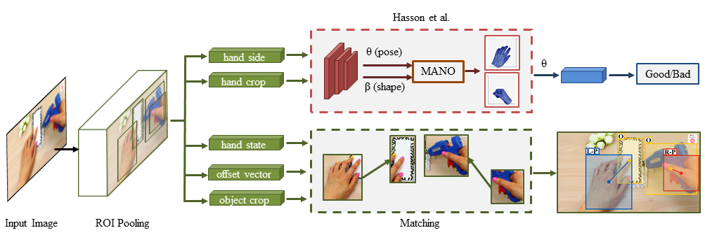
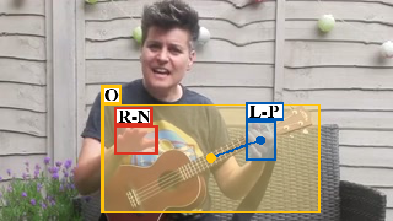

# Hand Object Detector 
This is the code for our paper *Understanding Human Hands in Contact at Internet Scale* (CVPR 2020, **Oral**).

Dandan Shan, Jiaqi Geng*, Michelle Shu*, David F. Fouhey




## Introduction

This repo is the pytorch implementation of our Hand Object Detector based on Faster-RCNN.

More information can be found at our:

* [Project and dataset webpage](http://fouheylab.eecs.umich.edu/~dandans/projects/100DOH/)


## Prerequisites
[New] Now, it is compatible with newer pytorch version. Thanks [ajonnavittula](https://github.com/ajonnavittula) and [relh](https://github.com/relh) for helping figure out the compile files.
Create a conda env called handobj_new, install pytorch-1.12.1, cuda-11.3:
* python=3.8
* cudatoolkit=11.3
* pytorch=1.12.1
```
conda create --name handobj_new python=3.8
conda activate handobj_new
conda install pytorch==1.12.1 torchvision==0.13.1 torchaudio==0.12.1 cudatoolkit=11.3 -c pytorch
```


[Old, deprecated] Create a conda env called handobj, install pytorch-1.0.1, cuda-10.0:
* Python 3.6
* Pytorch 1.0
* CUDA 10.0
```
conda create --name handobj python=3.6
conda activate handobj
conda install pytorch=1.0.1 torchvision cudatoolkit=10.0 -c pytorch
```


## Preparation

First of all, clone the code
```
git clone https://github.com/ddshan/hand_object_detector && cd hand_object_detector
```


## Environment & Compilation

Install all the python dependencies using pip:
```
pip install -r requirements.txt
```

Compile the cuda dependencies using following simple commands:
```
cd lib
python setup.py build develop
```

<!-- You will meet some errors about coco dataset: (not the best but the easiest solution)
```
cd data
git clone https://github.com/pdollar/coco.git 
cd coco/PythonAPI
make
``` -->
<!-- 
If you meet some error about spicy, make sure you downgrade to scipy=1.1.0:
```
pip install scipy=1.1.0
``` -->

PS:

Since the repo is modified based on [faster-rcnn.pytorch](https://github.com/jwyang/faster-rcnn.pytorch/tree/pytorch-1.0) (use branch pytorch-1.0), if you have futher questions about the environments, the issues in that repo may help.

## Performance (AP)
<!-- Table, test on all -->
- Tested on the testset of our **100K and ego** dataset:
<table><tbody>
<tr>
<td align="center">Name</td>
<td align="center">Hand</td>
<td align="center">Obj</td>
<td align="center">H+Side</td>
<td align="center">H+State</td>
<td align="center">H+O</td>
<td align="center">All</td>
<td align="center">Model Download Link</td>
</tr>

<tr>
<td align='left'>handobj_100K+ego</td>
<td align='center'>90.4</td>
<td align='center'>66.3</td>
<td align='center'>88.4</td>
<td align='center'>73.2</td>
<td align='center'>47.6</td>
<td align='center'>39.8</td>
<td align="center"><a href="https://drive.google.com/open?id=1H2tWsZkS7tDF8q1-jdjx6V9XrK25EDbE">faster_rcnn_1_8_132028.pth</a></td>
</tr>

<tr>
<td align='left'>handobj_100K</td>
<td align='center'>89.8</td>
<td align='center'>51.5</td>
<td align='center'>65.8</td>
<td align='center'>62.4</td>
<td align='center'>27.9</td>
<td align='center'>20.9</td>
<td align="center"><a href="https://drive.google.com/open?id=166IM6CXA32f9L6V7-EMd9m8gin6TFpim">faster_rcnn_1_8_89999.pth</a></td>
</tr>

</tbody></table>


<!-- Table, test on 100K -->
- Tested on the testset of our **100K** dataset:
<table><tbody>
<tr>
<tr><td align="center">Name</td>
<td align="center">Hand</td>
<td align="center">Obj</td>
<td align="center">H+Side</td>
<td align="center">H+State</td>
<td align="center">H+O</td>
<td align="center">All</td>
</tr>

<tr>
<td align='left'>handobj_100K+ego</td>
<td align='center'>89.6</td>
<td align='center'>64.7</td>
<td align='center'>79.0</td>
<td align='center'>63.8</td>
<td align='center'>45.1</td>
<td align='center'>36.8</td>
</tr>

<tr>
<td align='left'>handobj_100K</td>
<td align='center'>89.6</td>
<td align='center'>64.0</td>
<td align='center'>78.9</td>
<td align='center'>64.2</td>
<td align='center'>46.9</td>
<td align='center'>38.6</td>
</tr>

</tbody></table>


<!-- Table, test on ego -->
- Tested on the testset of our **ego** dataset:
<table><tbody>
<tr>
<tr><td align="center">Name</td>
<td align="center">Hand</td>
<td align="center">Obj</td>
<td align="center">H+Side</td>
<td align="center">H+State</td>
<td align="center">H+O</td>
<td align="center">All</td>
</tr>

<tr>
<td align='left'>handobj_100K+ego</td>
<td align='center'>90.5</td>
<td align='center'>67.2</td>
<td align='center'>90.0</td>
<td align='center'>75.0</td>
<td align='center'>47.4</td>
<td align='center'>46.3</td>
</tr>

<tr>
<td align='left'>handobj_100K</td>
<td align='center'>89.8</td>
<td align='center'>41.7</td>
<td align='center'>59.5</td>
<td align='center'>62.8</td>
<td align='center'>20.3</td>
<td align='center'>12.7</td>
</tr>

</tbody></table>


The model **handobj_100K** is trained on trainset of **100K** youtube frames. 

The model **handobj_100K+ego** is trained on trainset of **100K** plus additional **egocentric** data we annotated, which works much better on egocentric data. 

We provide the frame names of the egocentric data we used here: [trainval.txt](https://github.com/ddshan/hand_object_detector/blob/master/assets/data_ego_framename/trainval.txt), [test.txt](https://github.com/ddshan/hand_object_detector/blob/master/assets/data_ego_framename/test.txt). This split is backwards compatible with
the [Epic-Kitchens2018](https://epic-kitchens.github.io/2018) (EK), [EGTEA](http://cbs.ic.gatech.edu/fpv/), and [CharadesEgo](https://prior.allenai.org/projects/charades-ego) (CE).


## Train

### Data preparation  
Prepare and save pascal-voc format data in **data/** folder:
```
mkdir data
```
You can download our prepared pascal-voc format data from [pascal_voc_format.zip](https://fouheylab.eecs.umich.edu/~dandans/projects/100DOH/downloads/pascal_voc_format.zip) (see more of our downloads on our [project and dataset webpage](http://fouheylab.eecs.umich.edu/~dandans/projects/100DOH/download.html)).


### Download pre-trained Resnet-101 model
Download pretrained Resnet-101 model from [faster-rcnn.pytorch](https://github.com/jwyang/faster-rcnn.pytorch/tree/pytorch-1.0) (go to **Pretrained Model** section, download **ResNet101** from their Dropbox link) and save it like:
```
data/pretrained_model/resnet101_caffe.pth
```

So far, the data/ folder should be like this:
```
data/
├── pretrained_model
│   └── resnet101_caffe.pth
├── VOCdevkit2007_handobj_100K
│   └── VOC2007
│       ├── Annotations
│       │   └── *.xml
│       ├── ImageSets
│       │   └── Main
│       │       └── *.txt
│       └── JPEGImages
│           └── *.jpg
```

To train a hand object detector model with resnet101 on pascal_voc format data, run:
```
CUDA_VISIBLE_DEVICES=0 python trainval_net.py --model_name handobj_100K --log_name=handobj_100K --dataset pascal_voc --net res101 --bs 1 --nw 4 --lr 1e-3 --lr_decay_step 3 --cuda --epoch=10 --use_tfb 
```


## Test
To evaluate the detection performance, run:
```
CUDA_VISIBLE_DEVICES=0 python test_net.py --model_name=handobj_100K --save_name=handobj_100K --cuda --checkepoch=xxx --checkpoint=xxx
```


## Demo

### Image Demo

**Download models** by using the links in the table above from google drive.


**Save models** in the **models/** folder:
```
mkdir models

models
└── res101_handobj_100K
    └── pascal_voc
        └── faster_rcnn_{checksession}_{checkepoch}_{checkpoint}.pth
```


**Simple testing**: 

Put your images in the **images/** folder and run the command. A new folder **images_det** will be created with the visualization. Check more about argparse parameters in demo.py.
```
CUDA_VISIBLE_DEVICES=0 python demo.py --cuda --checkepoch=xxx --checkpoint=xxx
```


**Params to save detected results** in demo.py you may need for your task:
* hand_dets: detected results for hands, [boxes(4), score(1), state(1), offset_vector(3), left/right(1)]
* obj_dets: detected results for object, [boxes(4), score(1), <em>state(1), offset_vector(3), left/right(1)</em>]

We did **not** train the contact_state, offset_vector and hand_side part for objects. We keep them just to make the data format consistent. So, only use the bbox and confidence score infomation for objects.  

**Matching**:

Check the additional [matching.py](https://github.com/ddshan/Hand_Object_Detector/blob/master/lib/model/utils/matching.py) script to match the detection results, **hand_dets** and **obj_dets**, if needed.  


### One Image Demo Output:

Color definitions:
* yellow: object bbox
* red: right hand bbox
* blue: left hand bbox

Label definitions:
* L: left hand
* R: right hand
* N: no contact
* S: self contact
* O: other person contact
* P: portable object contact
* F: stationary object contact (e.g.furniture)





### Limitations
- Occasional false positives with no people.
- Issues with left/right in egocentric data (Please check egocentric models that work far better).
- Difficulty parsing the full state with lots of people.

<!-- ## Acknowledgment

xxx -->

## Citation

If this work is helpful in your research, please cite:
```
@INPROCEEDINGS{Shan20, 
    author = {Shan, Dandan and Geng, Jiaqi and Shu, Michelle  and Fouhey, David},
    title = {Understanding Human Hands in Contact at Internet Scale},
    booktitle = CVPR, 
    year = {2020} 
}
```
When you use the model trained on our ego data, make sure to also cite the original datasets ([Epic-Kitchens](https://epic-kitchens.github.io/2018), [EGTEA](http://cbs.ic.gatech.edu/fpv/) and [CharadesEgo](https://prior.allenai.org/projects/charades-ego)) that we collect from and agree to the original conditions for using that data.